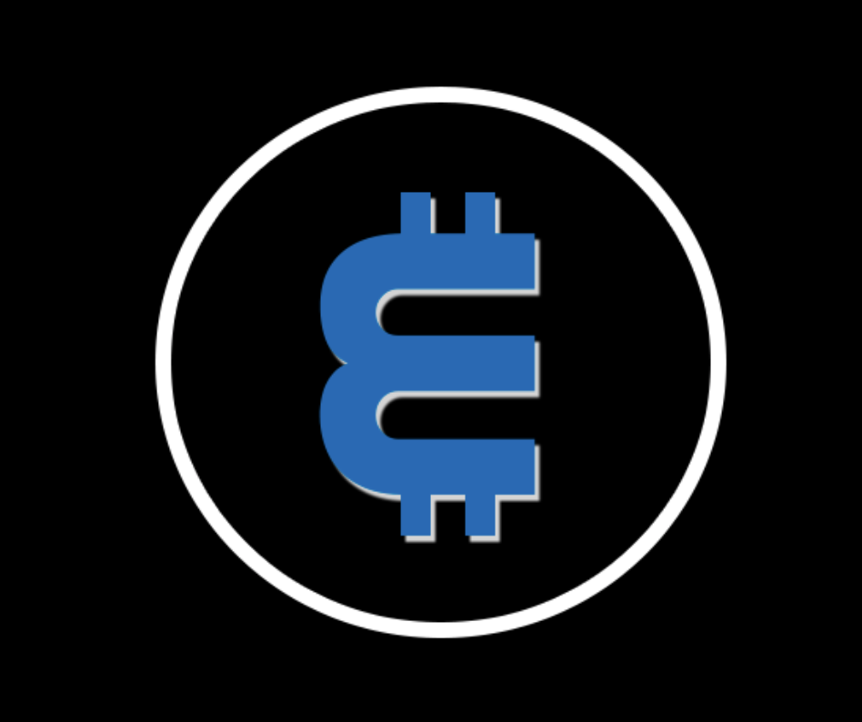

# EpiCoin
EpiCoin Application

### What ?
The EpiCoin app is an easy interface allowing its users to exchange their EpiCoins with other app users.

### Why ?
Epitech has solidified its reputation as a leading educational institution of technology. Let's digitalize our schools whith tokens and relevant tools to improve the student life experience.

### Who ?
The EpiCoin is designed to be used by the Epitech students and aims at being available to all the IONIS group's students.

### Credits
Made by :
- [Nicolas Laurent](https://github.com/Nicolrnt)
- Cyril Chaillan
- [Théo Olivieri](https://github.com/TheoEkoha)
